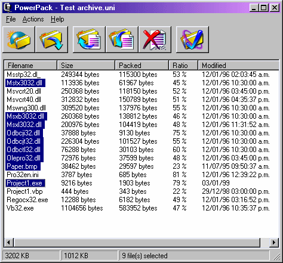



## PowerPack

### Description

This is a file compression and decompression utility. It's very, very fast because it uses the zlib compression library (included). Encryption supported. Also it can compress huge files without consuming too much memory. You can learn a lot by examining the source code. A search engine and a compressed files renaming system has been implemented. Help file included. Now the compression library is inside the EXE so you don't have to distribute it. Self-Extracting module included. Last Update: May 25th, 2001
 
### More Info
 

             |
---                |---
**Submitted On**   |2001-05-22 20:26:08
**By**             |[Paul Guerra](https://github.com/Planet-Source-Code/PSCIndex/blob/master/ByAuthor/paul-guerra.md)
**Level**          |Intermediate
**User Rating**    |4.8 (38 globes from 8 users)
**Compatibility**  |VB 6\.0
**Category**       |[Complete Applications](https://github.com/Planet-Source-Code/PSCIndex/blob/master/ByCategory/complete-applications__1-27.md)
**World**          |[Visual Basic](https://github.com/Planet-Source-Code/PSCIndex/blob/master/ByWorld/visual-basic.md)
**Archive File**   |[PowerPack199315222001\.zip](https://github.com/Planet-Source-Code/paul-guerra-powerpack__1-22987/archive/master.zip)

